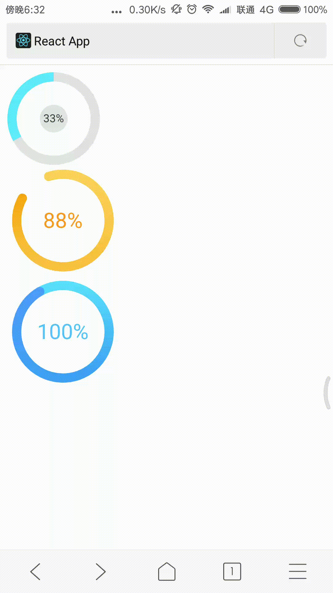

react citcle progress three type CanCirPro SvgCirPro 支持渐变色和动画


### Installation

```cmake
npm i react-circle-progress
```

### Usage

```react
import { SvgCirPro,CanCirPro,CircleProgress } from "react-circle-progress";
```


### More examples

```react
ReactDOM.render(<div>

    <CircleProgress percent={33} />

    <CanCirPro percent={88} />

    <SvgCirPro percent={100}/>

</div>, document.getElementById('root'));

```

